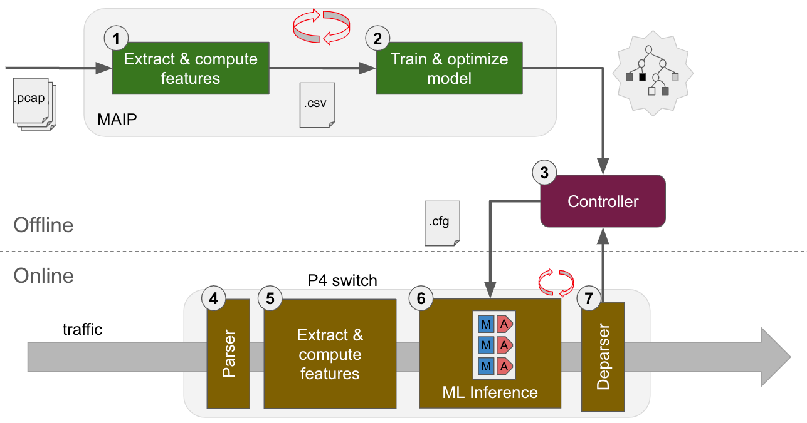

# inline-traffic-classification-using-p4
A ML-based inline traffic classification using P4

This repository implements a machine-learning-based approach to classify encrypted network traffic using P4. The testbed is evaluated on a P4 virtual device, [BMv2 Simple Switch](https://github.com/p4lang/behavioral-model/blob/main/docs/simple_switch.md). The model is [Decision Tree Classifier](https://scikit-learn.org/stable/modules/generated/sklearn.tree.DecisionTreeClassifier.html) using 3 features which are independent of packets' payload (that is encrypted) :

- `iat` (Inter-Arrival Time): different arrival time of the current packet and the one of the previous packet
- `len`: total length of the current IP packet
- `diffLen`: different of `len` (that represents the difference of lengths of 2 consecutive IP packets)

The source code consists mainly 2 parts:

- [offline](./src/offline) contains tools to extract features from pcap files, train model, evaluate model and generate P4 match-action tables' entries
- [bmv2](./src/bmv2) contains P4 code to run BMv2 switch which performs the infererence of the DT model against network traffic
- [p4pi](./src/p4pi) contains P4 code to run inside a Raspberry Pi which installs [P4PI](https://github.com/p4lang/p4pi) and its controller



# Execution

The execution can be performed basically in 2 steps as below.

## Model preparation

```bash
cd ./bmv2/offline
# extract iat and len features from pcap files in ./pcaps folder
././process_pcaps.py

# train a DT model using the features above
 ./train_model.py

# generate match-action table's entries to configure P4 switch
./generate_table_entries.py 
```

## Inference

See prerequisites [here](./src/bmv2#prerequisite)

```bash
cd ./src/bmv2
# start P4 switch
make run

# open a new terminal, start the controller which will:
# - configure the switch within the table's entries generated above
# - receive inference output from the switch
./controller.py

# back to the first terminal of P4 switch, use tcpreplay to generate some traffic
mininet> sh tcpreplay -i s1-eth1  --preload-pcap --timer=gtod ../offline/pcaps/skype.v2.pcap
```

### Note: Inaccuracy classification
You might notice that the inference output is inaccuracy wrt the replaying pcap file, e.g., the output of the controller is as the following when replaying `skype.v2.pcap` file:

```bash
[Mon Apr 08 14:28:09] mmt@mmt:bmv2$ ./controller.py 
192.168.1.34 157.55.130.153 50057 443 6 => 0 64 0 => unknown
157.55.130.153 192.168.1.34 443 50057 6 => 130404000 60 65531 => skype
192.168.1.34 157.55.130.153 50057 443 6 => 445000 52 65527 => webex
192.168.1.34 157.55.130.153 50057 443 6 => 494000 124 65607 => webex
157.55.130.153 192.168.1.34 443 50057 6 => 133455000 52 65463 => skype
192.168.1.34 157.55.130.153 50057 443 6 => 316000 86 65569 => whasapp
192.168.1.34 157.55.130.153 50057 443 6 => 533322000 86 65535 => skype
192.168.1.34 157.55.130.153 50057 443 6 => 857429000 86 65535 => skype
192.168.1.34 157.55.130.153 50057 443 6 => 1511845000 86 65535 => skype
192.168.1.34 157.55.130.153 50057 443 6 => 2820222000 86 65535 => skype
192.168.1.34 157.55.130.153 50057 443 6 => 5447201000 86 65535 => skype
192.168.1.34 157.55.130.153 50057 443 6 => 2026143000 52 65501 => skype
192.168.1.34 157.55.130.153 50057 443 6 => 5509756000 86 65569 => skype
157.55.130.153 192.168.1.34 443 50057 6 => 129894000 93 65542 => skype
192.168.1.34 157.55.130.153 50057 443 6 => 1478000 40 65482 => whasapp
```

There are few packets which are classified as `webex` (unless the first packet is unknown as it has no IAT).
However this inference in the P4 switch is performed correctly as its [score](https://scikit-learn.org/stable/modules/generated/sklearn.tree.DecisionTreeClassifier.html#sklearn.tree.DecisionTreeClassifier.score) is 100%, e.g.,
```bash
src/offline$ ./predict_file.py 
Score 1.0
```

When comparing this output with the [extracted features](./src/offline/pcaps/skype.v2.csv), we see that the IAT values have been changed. This difference is caused by:
- tcpreplay cannot replay exactly packets in the time
- and the software switch of P4 [does not capture precisely](https://github.com/p4lang/behavioral-model/blob/main/docs/simple_switch.md#bmv2-timestamp-implementation-notes) arrival timestamp of packets


When using only `len` and `diffLen` features, then the BMv2 switch can infer *correctly* when replaying `skype.v2.pcap`. See result [here](https://github.com/Montimage/inline-traffic-classification-using-p4/tree/replace-iat-by-diffLen?tab=readme-ov-file#inference).
